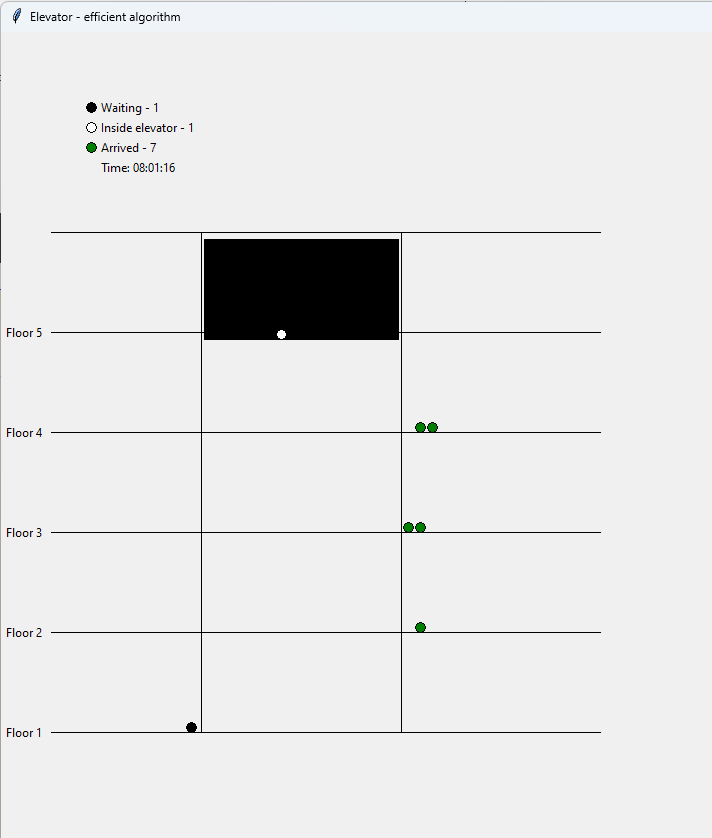

# Elevator Simulation

This project is forked from a project by <a href="https://github.com/mrbrianevans">mrbrianevans</a> and simulates the behavior of an elevator system in a building with multiple floors. The simulation includes two different algorithms for elevator movement and provides the option to visualize the elevator's operations.


## Features

- **Random Data Generation:** Generates random timestamped data to simulate elevator usage over a period.
- **Biased Floor Selection:** Allows for biased floor selection based on time of day, simulating typical elevator usage patterns.
- **Simulation Algorithms:**
  - **Baseline Algorithm:** Follows a simple up-and-down approach, reversing direction only at the top or bottom floors.
  - **Design your own:** Test functions before submitting to the Data Engineers' Coding Challenge!
- **Animation:** Visualize the elevator's movements and passenger behavior using a GUI.

## Files

- **elevator_simulation.py:** The core simulation script that defines the behavior of the elevator, the people using it, and the various algorithms that control it. The simulation can run with or without animation.
- **charts.py:** A script for generating visualizations such as histograms of elevator wait times and plots of mean floor entries/exits by time interval.
- **create_entries.py:** A script for generating a pandas DataFrame of simulated entries and exits throughout the day. 
- **run_lifts.ipynb:** A Jupyter notebook that provides an interface to run and test the elevator simulation with different parameters and visualise the results.  
  - **Efficient Algorithm:** Prioritizes passengers already in the elevator and optimizes for the closest destination.
  - **Baseline Algorithm:** Follows a simple up-and-down approach, reversing direction only at the top or bottom floors.
- **Animation:** Visualize the elevator's movements and passenger behavior using a GUI.

## Prerequisites

- Python 3.x
- Libraries: `random`, `pandas`, `datetime`, `tkinter`, `time`

## Installation

Clone this repository:

```bash
git clone https://github.com/uncultivate/elevator-master.git
cd elevator-master
```

## Usage

### Running the Simulation
To run the simulation, use the single_simulation function:

```python
single_simulation(algorithm="baseline", data=df, floors=10, max_elevator_capacity=6, animate=True, animation_speed=1)
```

* algorithm: Test with the example "baseline" algorithm, then create your own function with elevator logic.
* function_dict: Run the simulation for these functions.
* data: Pass the entries data as a DataFrame.
* floors: Number of floors in the building.
* max_elevator_capacity: Maximum number of people the elevator can carry.
* animate: Set to True to enable the animation.
* animation_speed: Control the speed of the animation.

## Viewing the Results
The results, including total time elapsed, shortest wait time, longest wait time, and average wait time, can be created as a DataFrame. If the animation is enabled, these results will also appear in the GUI.
